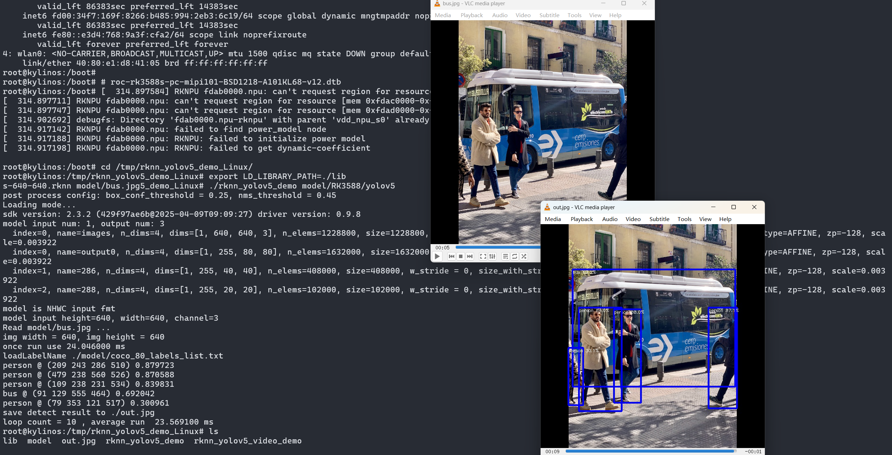

# RKNPU 驱动
#### 目标检测yolov5功能在Linux上的正常工作状态如下图：




### 驱动开发要点：

1. 用户态的AI算法程序，依赖众多syscall的实现，具体如下所述；

2. RKNPU驱动的内存管理，依赖GPU显存DRM GEM，否则会报段错误：`DMABUF_HEAPS_ROCKCHIP_CMA_HEAP`;

3. RKNPU的设备驱动依赖IOMMU的实现，如果直接disable iommu时，在申请dma页时出错。

#### rknn yolov5 syscall 统计

其中用户态demo程序，依赖libc库：`GLIBC 2.31`

对syscall的依赖包括如下：
`sched_yield`,
`ioctl`,
`read`,
`write`,
`openat`,
`mmap`,
`munmap`,
`mprotect`,
`close`,
`fstat`,
`set_robust_list`,
`brk`,
`clone`,
`newfstatat`,
`clock_nanosleep`,
`faccessat`,
`getcwd`,
`geteuid`,
`rt_sigaction`,
`execve`,
`prlimit64`,
`set_tid_address`,
`lseek`,
`futex`,
`rt_sigprocmask`,

```
# strace -f -c -o rknn_yolov5_syscall.txt ./rknn_yolov5_demo model/RK3588/yolov5s-640-640.rknn model/bus.jpg

% time     seconds  usecs/call     calls    errors syscall
------ ----------- ----------- --------- --------- ----------------
 63.09    0.462553          65      7027           sched_yield
 27.79    0.203761         913       223         2 ioctl
  1.99    0.014609         205        71           read
  1.79    0.013143         193        68           write
  1.60    0.011726          79       148       128 openat
  1.54    0.011287         201        56           mmap
  0.97    0.007095         337        21           munmap
  0.46    0.003339          98        34           mprotect
  0.27    0.002006          74        27           close
  0.14    0.001001          52        19           fstat
  0.08    0.000561          70         8           set_robust_list
  0.07    0.000502          45        11           brk
  0.05    0.000360          51         7           clone
  0.04    0.000275          45         6           newfstatat
  0.03    0.000254         254         1           clock_nanosleep
  0.03    0.000214         214         1         1 faccessat
  0.02    0.000124          62         2           getcwd
  0.02    0.000118          39         3           geteuid
  0.01    0.000074          37         2           rt_sigaction
  0.01    0.000066          66         1           execve
  0.01    0.000039          39         1           prlimit64
  0.00    0.000025          25         1           set_tid_address
  0.00    0.000024           2        11           lseek
  0.00    0.000011           5         2           futex
  0.00    0.000009           9         1           rt_sigprocmask
------ ----------- ----------- --------- --------- ----------------
100.00    0.733176                  7752       131 total

post process config: box_conf_threshold = 0.25, nms_threshold = 0.45
Loading mode...
sdk version: 2.3.2 (429f97ae6b@2025-04-09T09:09:27) driver version: 0.9.8
model input num: 1, output num: 3
  index=0, name=images, n_dims=4, dims=[1, 640, 640, 3], n_elems=1228800, size=1228800, w_stride = 640, size_with_stride=1228800, fmt=NHWC, type=INT8, qnt_type=AFFINE, zp=-128, scale=0.003922
  index=0, name=output0, n_dims=4, dims=[1, 255, 80, 80], n_elems=1632000, size=1632000, w_stride = 0, size_with_stride=1638400, fmt=NCHW, type=INT8, qnt_type=AFFINE, zp=-128, scale=0.003922
  index=1, name=286, n_dims=4, dims=[1, 255, 40, 40], n_elems=408000, size=408000, w_stride = 0, size_with_stride=491520, fmt=NCHW, type=INT8, qnt_type=AFFINE, zp=-128, scale=0.003922
  index=2, name=288, n_dims=4, dims=[1, 255, 20, 20], n_elems=102000, size=102000, w_stride = 0, size_with_stride=163840, fmt=NCHW, type=INT8, qnt_type=AFFINE, zp=-128, scale=0.003922
model is NHWC input fmt
model input height=640, width=640, channel=3
Read model/bus.jpg ...
img width = 640, img height = 640
once run use 24.437000 ms
loadLabelName ./model/coco_80_labels_list.txt
person @ (209 243 286 510) 0.879723
person @ (479 238 560 526) 0.870588
person @ (109 238 231 534) 0.839831
bus @ (91 129 555 464) 0.692042
person @ (79 353 121 517) 0.300961
save detect result to ./out.jpg
loop count = 10 , average run  20.387200 ms

# ldd rknn_yolov5_demo
        linux-vdso.so.1 (0x0000007f81c80000)
        librknnrt.so => lib/librknnrt.so (0x0000007f814e0000)
        librga.so => lib/librga.so (0x0000007f8149f000)
        libdl.so.2 => /lib/aarch64-linux-gnu/libdl.so.2 (0x0000007f81474000)
        libpthread.so.0 => /lib/aarch64-linux-gnu/libpthread.so.0 (0x0000007f81444000)
        librt.so.1 => /lib/aarch64-linux-gnu/librt.so.1 (0x0000007f8142c000)
        libstdc++.so.6 => /lib/aarch64-linux-gnu/libstdc++.so.6 (0x0000007f81247000)
        libm.so.6 => /lib/aarch64-linux-gnu/libm.so.6 (0x0000007f8119c000)
        libgcc_s.so.1 => /lib/aarch64-linux-gnu/libgcc_s.so.1 (0x0000007f81178000)
        libc.so.6 => /lib/aarch64-linux-gnu/libc.so.6 (0x0000007f81005000)
        /lib/ld-linux-aarch64.so.1 (0x0000007f81c50000)
```